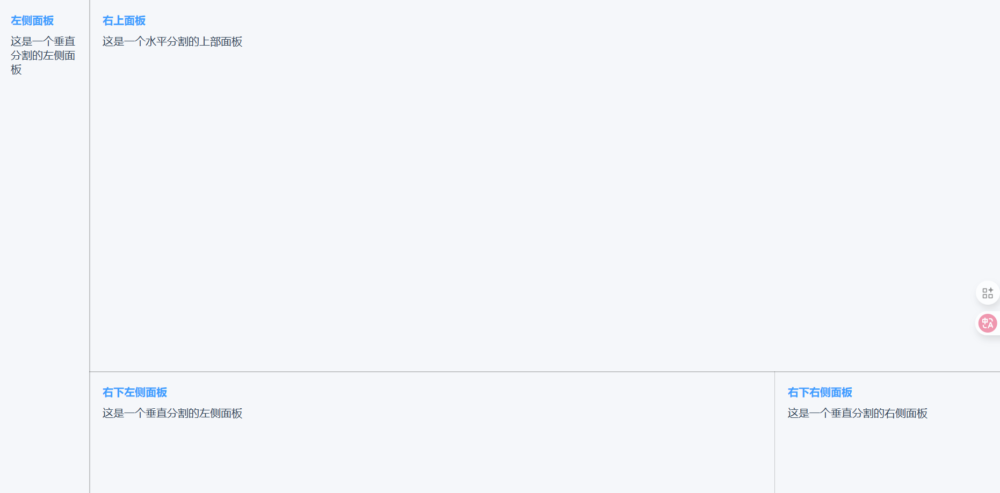

# @pori15/split-pane



## 简介

- @pori15/split-pane 是一个基于 Vue3+TypeScript 的分割面板组件，功能类似于 `vscode` 的面板分割，常见于在线代码编辑器、管理后台等需要灵活布局的场景。
- 支持垂直（左右）和水平（上下）分割模式
- 支持嵌套使用，可创建复杂的多面板布局
- 提供完善的无障碍访问支持
- 响应式设计，适配移动设备

## 安装

```bash
npm install @pori15/split-pane --save
```

或使用 pnpm（推荐）

```bash
pnpm add @pori15/split-pane
```

## 基本用法

```vue
<template>
  <split-pane :min-percent="0" :default-percent="20" split="vertical">
    <template v-slot:paneL> vertical-A </template>
    <template v-slot:paneR>
      <split-pane split="horizontal" :default-percent="75">
        <template v-slot:paneL> horizontal-B </template>
        <template v-slot:paneR>
          <split-pane split="vertical" :default-percent="75">
            <template v-slot:paneL> vertical-C </template>
            <template v-slot:paneR> vertical-D </template>
          </split-pane>
        </template>
      </split-pane>
    </template>
  </split-pane>
</template>

<script setup lang="ts">
import { defineAsyncComponent } from "vue";
const SplitPane = defineAsyncComponent(() => import("@pori15/split-pane"));
</script>
```

## 属性

| 属性名         | 类型   | 默认值 | 说明                                                                           |
| -------------- | ------ | ------ | ------------------------------------------------------------------------------ |
| minPercent     | Number | 10     | 面板的最小尺寸百分比                                                           |
| defaultPercent | Number | 50     | 面板的默认尺寸百分比                                                           |
| split          | String | -      | 分割方向：'vertical'（垂直分割，左右布局）或'horizontal'（水平分割，上下布局） |
| className      | String | -      | 分割条的自定义类名，用于自定义样式                                             |

## 插槽

| 名称  | 说明                 |
| ----- | -------------------- |
| paneL | 左侧或上侧面板的内容 |
| paneR | 右侧或下侧面板的内容 |

## 事件

| 事件名 | 参数            | 说明                                             |
| ------ | --------------- | ------------------------------------------------ |
| resize | percent: number | 当面板大小调整时触发，返回当前分割位置的百分比值 |

## 高级用法

### 嵌套分割面板

可以在任意面板内嵌套使用SplitPane组件，创建复杂的多面板布局：

```vue
<template>
  <div class="container">
    <split-pane split="vertical" :default-percent="30">
      <!-- 左侧导航面板 -->
      <template v-slot:paneL>
        <div class="nav-panel">导航菜单</div>
      </template>
    
      <!-- 右侧内容区，再次分割 -->
      <template v-slot:paneR>
        <split-pane split="horizontal" :default-percent="70">
          <!-- 上方内容区 -->
          <template v-slot:paneL>
            <div class="content-panel">主要内容</div>
          </template>
        
          <!-- 下方控制台区 -->
          <template v-slot:paneR>
            <div class="console-panel">控制台输出</div>
          </template>
        </split-pane>
      </template>
    </split-pane>
  </div>
</template>
```

### 自定义分割条样式

通过提供自定义className，可以覆盖默认的分割条样式：

```vue
<template>
  <split-pane split="vertical" class-name="custom-resizer">
    <!-- 面板内容 -->
  </split-pane>
</template>

<style>
.custom-resizer {
  /* 自定义分割条样式 */
  background-color: #3498db !important;
  opacity: 0.5 !important;
}
</style>
```

## 无障碍支持

组件内置了ARIA属性支持，提供了良好的无障碍访问体验：

- 分割面板容器具有 `role="presentation"`和 `aria-label="可调整大小的分割面板"`
- 分割条具有 `role="separator"`，可通过键盘操作
- 面板大小变化时会更新 `aria-valuenow`属性

## 浏览器兼容性

- 支持所有现代浏览器
- 针对移动设备进行了触摸优化

## 许可证

MIT
